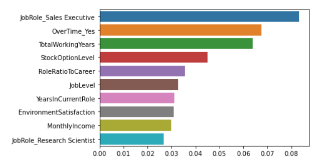

# Identifying Employee Attrition

*According to the 2014 Training Industry Report from Training magazine, the annual training budgets of U.S. small businesses totaled an average of 308 thousand dollars in 2014, with retail and wholesale spending more tha half a million dollars. Approximately twelve hundred dollars was spent per employee.*  
-Forbes  

It's important to identify which employees are at risk for attrition and more importantly, why they quit and how to retain workers. 
We can use this data to reduce pain points to create better environments for employees, reducing administrative costs of onboarding, and freeing up time supervisors/mentors use to bring a new hire up to speed, which could be used working on projects and developing strategy. 

## 1. Data

This data is from a kaggel data set designed by scientists at IBM

[IBM HR Analytics Employee Attrition and Performance](https://www.kaggle.com/uniabhi/ibm-hr-analytics-employee-attrition-performance)

## 2. EDA and Data Cleaning 

[Data Cleaning Report](Notebooks/EDA_DataWrangling.ipynb)

There are many more "Yes" than "No" in our target variable Attrition.
MonthlyIncome is very screwed to the left while the Monthly rate was stable.
A majority of workers have less than 100 hours in a month while the maximum is in the 600 if we divide rate by income.
There are a large number of employees that have exclusively worked at this company

Over18, EmployeeCount, and StandardHours were dropped for having either 1 or 1470 unique values (the size of the data set)

Sanity checks where also performed to make sure that no employee's years with their current manager or roles was higher than their time with the company itself 

#### High Attrition rates in:
> * Low Environment Satisfaction
> * Poor Work life Balance
> * Low Job Involvement/Level/Satisfaction
> * Sales Roles
> * Low monthly income

## 3. Preprocessing

[Prepocessing](Notebooks/Preprocessing.ipynb)

FieldVsDept was made as feature to see if a misaligning education with  work had an impact on attrition.
Ratios of an employees time in their current role and with their current manager were created as a measure of stagnation in the company.

BusinessTravel was quanified on a scale of 1 to 3.

FieldVsDept and other catergorical features were onehot encoded into binarie sbefore being split into 70% train and 30% test sets with attrition as the target Y varaible

## 4. Modeling

[Modeling](Notebooks/Modeling.ipynb)

I tried CV search with 4 different models with and without SMOTE using f1 score as the basis for assessing model performance, particularly for Attrition True as it is the minority class. These are my top 3 models

> * Excelerated Gradient Boost (SMOTE): - Attrition_True f1-score of 60%
> * Excelerated Gradient Boost (no SMOTE): - Attrition_True f1-score of 59%
> * Logistic Regression (No SMOTE) : - Attrition_True f1-score of 57%

KNN and Random Forest Predictions with or without SMOTE failed to break 50% in the minority class

## 5. Predictions & Recommendations

Unsuprisingly, working in sales or working overtime contribute to attrition. Coaching on time management for those working overtime or options for different pay structures so sales executives have more security is in order.  

You might be suprised to see TotalWorkingYears and and stock option levels because they are signs of job security, but employees with higher numbers in these features are naturally, up for retirement. 

Since years / ratio of a person's role is also a contributing factor.  
Its possible more room for growth/ advancement/ transfers would be good for employee's who quit because they are bored or feel stuck in their current role. 

## 6. Contraints and Future Improvements

* Even though the dataset was created by IBM data scientists, that doesn't nessessairly meant it is representive of IBM or any real pattern in attrition rates in the the real world. That being said, I'll these are the improvements that could be made if this was data at a real company.

* While features like Job Involvement, Education, Performance where intuatively scalar values that were explained in the description of the [dataset](https://www.kaggle.com/uniabhi/ibm-hr-analytics-employee-attrition-performance), many of the monetary (hourly rate, daily rate, and particularly: monthly income vs monthly rate) could and perhaps should be explain, sepecially when monthly rate and income are s different.

* The dataset also does not have starta and end dates as a feature which would been useful for a more granular look at employyes who quit under a year

* While job performance is rated from a 1-4, there are only ratings of 3 or more in the dataset. Is it possible that performance of 2 or less results in attrition in all instances? Is attrition in this dataset inclusive of workers who were terminated, and not just the one's who move on? Context for attrition as a classification, and the inclusion of proosibly ommitted data on lower performing workers could be helpful
