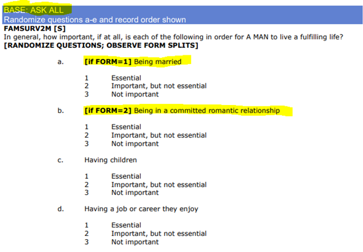
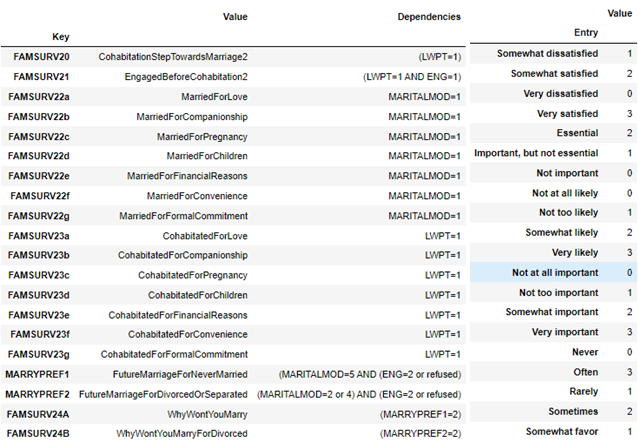
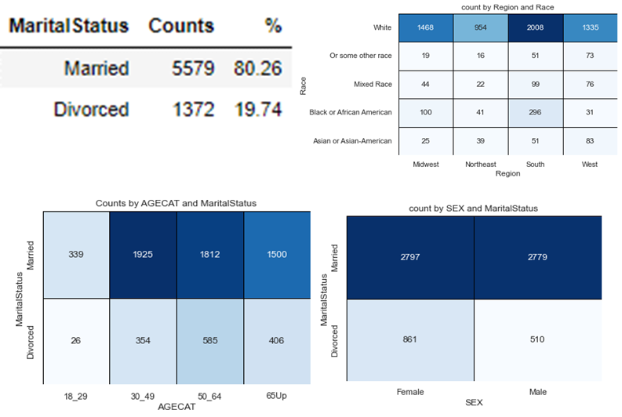
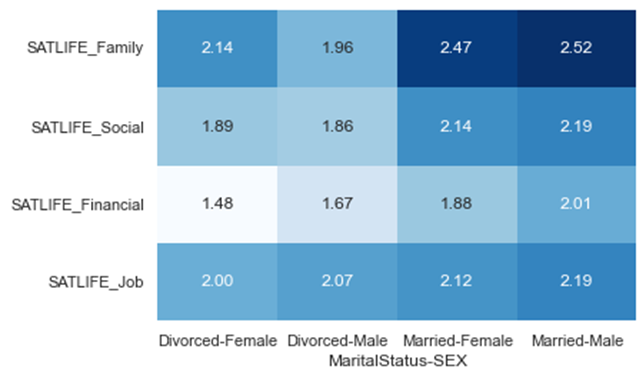
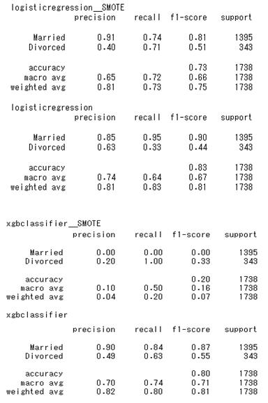
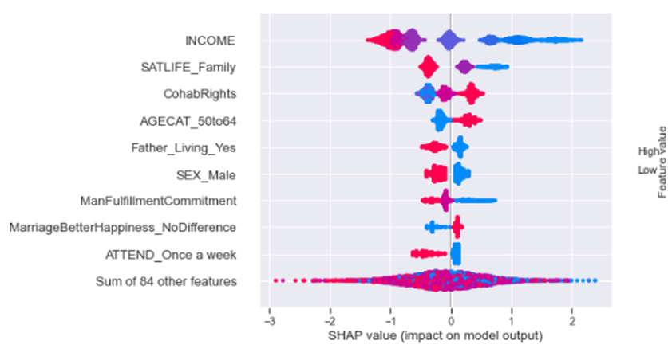

# Predicting Divorce by attitudes of Marriage and Cohabitation

* The average total cost of divorce in the United States is \$15,000
* Families with children that were not poor before the divorce see their income drop as much as 50 percent.
* One researcher determined that a single divorce costs state and federal governments about \$30,000, based on such things as the higher use of food stamps and public housing as well as increased bankruptcies and juvenile delinquency.
* A new study entitled “Divorce and Death” shows that broken marriages can kill at the same rate as smoking cigarettes. Indications that the risk of dying is a full 23 percent higher among divorcées than married people.
* If a close friend gets divorced, you are 147% more likely to become divorced and 33% more likely if a friend of a friend is divorced.

--- [Wilkinson & Finkbeiner Family Law Attorneys](https://www.wf-lawyers.com/divorce-statistics-and-facts/)

Divorce is a stressful and costly process that takes a toll on individuals, families, and their friends. Barring a situation where staying married would do more harm than good, divorces are better to be avoided and a marriage mended.
Ideally, we find out which attitudes towards marriage, cohabitation, family, are predictive of divorce – and that these are attitudes that can be changed

# 1. The Data

Survey data from  [Pew Research](https://www.pewresearch.org/social-trends/dataset/american-trends-panel-wave-50/) is a sample of almost 10,000 survey samples of individuals answering questions relating to participants' attitudes and experience with cohabitation, engagement, marriage, and child rearing along with their demographics (education, political affiliation, rage, race, etc)

Using this data I want to predict if an individual is divorced or married and identify which factors are strongly predictive of divorce.

### 1.1 Basic Structure

The survey was programmed to only ask "relevant" questions based on past answers, (example "Are you currently engaged" would only be asked to unmarried participants). These unasked questions result in many NaNs across the dataset totallying about 27000.

### 1.2 Limitations in scope

While the forking questions are for the most part well programmed, there were some questionable dependencies and inconsistencies.

The data was split into two different forms. The questions on both forms varied only slightly with Form One asking about the importance of having a stable financial situation, steady job, house, etc before marriage while Form Two asked the same questions but for cohabitation. It would have been nice to see if there were large differences between attitudes between marriage and cohabitation on a participant level.

Only currently married and cohabiting participants are asked how much love, money, and other factors played into their decision of getting married or cohabiting but divorced and separated participants were not asked about their motivations to get married. 

Similarly, satisfaction, trust metrics, and household management questions for relationship specific features are also only done for married and cohabiting couples, leaving no insight into the feelings of those who were divorced or separated. Married participants were also asked if they had cohabitated before carrying their current spouse..

# 2. Data Preparation

[Data Wrangling & EDA Notebook](Notebooks/0_DataWrangling_EDA.ipynb)

Original Feature names were mostly FAMSURV{...}  so I created a Question_Key.csv file to map the feature names to something more descriptive of the question. In the same Question_Key.csv file I have entered the dependencies of each question and here will only use questions that were asked to everyone, or are relative to our model.

Much of the data is string data indicating a strength of agreement / satisfaction/ importance that can be converted into an integer. I created Replacements.csv common answers and their weights.

# 3. EDA

* Divorces make up around 20% on the samples. 
* Not as many marriages and divorces for participants under 30
* More female participants than males
* Most of the participants where white, with a spread across the US

Overall, married individuals enjoyed higher satisfaction rates in life, and their partners vs divorcees with a significant other. Individuals marry more for a formal commitment and children while the motivators for cohabitation are financial and convenience. 

Attitudes towards the opposite sex and what they require to live a fullfilling life follow gender norms in that men think women require children and commitment more than women themselves do, and women think that men require enjoyment/success in their career than men themselves do.

# 4. Preprocessing and Modeling

### 4.1 The Pipeline

* Divorce was chosen as the target variable
* Logistic Regression and XGBOOST were chosen as models
* Data was split into 75% train and 25% test data with the target variable stratified
* Train and Test data were separately imputed with the mean and scaled to prevent data leakage
* Evaluation was done using 5-fold cross validation to make the model more robust
* BayesSearchCV was chosen to search a wider net of hyperparameters
* Models were evaluated on the Mathew's Correlation Coefficient
* SMOTE was tried and compared to the normal model because of class imbalance

### 4.2 Model Results

XGBoost performed the best overall and predicted using the attitudes and satisfaction scores as opposed to logistic regression which mainly returned income and age as predictors.

### 4.3 Predictors

* Lower Income
* Lower family satisfaction scores
* Support of cohabiting couples having similar rights as married couples
* Underestimating a man's fulfillment from being in a committed relationship

# 5. Conclusion

### 5.1 Possible Applications

Couples can fill out surveys with the most predictive features to assess their risk of divorce and recommend couples counseling or individual therapy.

### 5.2 Improvements, Limitations, and Considerations

* Ultimately would be better with more Data
 * Missing information on the opinions of divorcees pre-divorce.
 * Questions that coupled have been asked to divorcees (that were asked to married only):
    * Motivations for getting married previously
    * Did you cohabitate prior to your previous marriage
    * Did you feel pressured to get married
    * Satisfaction/Trust in your previous marriage
 * It takes two to tango
    * Observations in the data set are of individuals, not couples
    * Relationship dynamics would likely be more predictive than opinions about companionship
* The ground truth of the target feature can change
    * Married individuals can get divorced down the line
    * Divorced individuals can remarry
